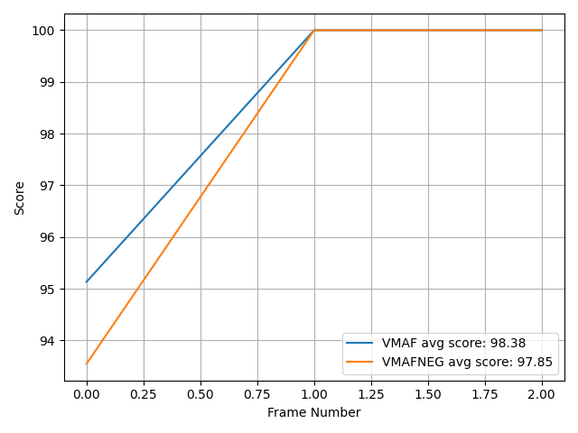

# vmaf-notebook
vmaf-notebook is a dockerized environment to run [VMAF](https://github.com/Netflix/vmaf) (and [VMAF-NEG](https://github.com/Netflix/vmaf/blob/master/resource/doc/models.md#disabling-enhancement-gain-neg-mode), [PSNR](https://en.wikipedia.org/wiki/Peak_signal-to-noise_ratio), [SSIM](https://en.wikipedia.org/wiki/Structural_similarity)...) video quality metrics.

## Create a docker image

First, pull in the VMAF repo as a submodule and run preparation script:
```shell
git submodule update --init --recursive --depth 1
./prepare.sh
```

Build the docker image (this will invoke the commands in ./Dockerfile):
```shell
docker build -t vmaf-notebook .
```

## Start a docker container, bash into it and run tests

To start a docker container from the image created and bash into it:
```shell
docker run -dit --volume $(pwd):/opt/project --name vmaf-notebook-container vmaf-notebook
docker exec -it vmaf-notebook-container bash
```

(If you want to mount additional volumes, you can do something like adding a second `--volume /Users:/Users` to mount the entire `/Users` directory in your native OS to the docker container.)

To ensure that the container is configured correctly, run tests by invoking `tox` (this invokes commands in the ./tox.ini file):
```shell
tox
```
This command runs three checks: the standard (py39), coverage and style. Each can be individually triggered as well:
```shell
tox -e py39
tox -e coverage
tox -e style
```
You should expect all tests pass.

After use, to exit the container:
```shell
exit
```

To stop and destroy the container:
```shell
docker rm -f vmaf-notebook-container
```

## Run VMAF and other video quality metrics

Assume you are inside the docker container. There are two ways of running VMAF and other metrics:

### Way #1: the bare-bones way

The bare-bones way is to manually decode (using `ffmpeg`) both the reference and the encoded videos into raw videos (YUV format), and invoking the `vmaf` command line (aliased as `vmafossexec_lts` below for production reasons):
```shell
/tools/ffmpeg/ffmpeg -i /opt/project/tests/resource/y4m/ParkJoy_480x270_50.y4m -f rawvideo -pix_fmt yuv420p /opt/project/workspace/ParkJoy_480x270_50.yuv
/tools/ffmpeg/ffmpeg -i /opt/project/tests/resource/obu/parkjoy_qp160.obu -f rawvideo -pix_fmt yuv420p /opt/project/workspace/parkjoy_qp160.yuv
/usr/local/bin/vmaf --reference /opt/project/workspace/ParkJoy_480x270_50.yuv --distorted /opt/project/workspace/parkjoy_qp160.yuv --width 480 --height 270 --pixel_format 420 --bitdepth 8 --xml --feature psnr --feature float_ssim --model path=/opt/project/vmaf/python/vmaf/model/vmaf_v0.6.1.json:name=vmaf --model path=/opt/project/vmaf/python/vmaf/model/vmaf_v0.6.1neg.json:name=vmafneg --quiet --output /dev/stdout
```
You should expect output like:
```xml
<VMAF version="e19d489a">

    ...

    <metric name="psnr_y" min="41.751970" max="41.862815" mean="41.818631" harmonic_mean="41.818577" />
    <metric name="psnr_cb" min="42.725539" max="42.823630" mean="42.780453" harmonic_mean="42.780415" />
    <metric name="psnr_cr" min="43.622090" max="43.717101" mean="43.669397" harmonic_mean="43.669364" />
    <metric name="float_ssim" min="0.979634" max="0.980331" mean="0.980044" harmonic_mean="0.980044" />
    <metric name="vmaf" min="95.133704" max="100.000000" mean="98.377901" harmonic_mean="98.324069" />
    <metric name="vmafneg" min="93.549100" max="100.000000" mean="97.849700" harmonic_mean="97.754068" />
  </pooled_metrics>
  <aggregate_metrics />
</VMAF>
```
It computes the per-frame and aggregate VMAF, VMAF-NEG, PSNR, SSIM video quality metrics of a reference and an encoded video and report back the results in a XML file.

### Way #2: construct a script using the VMAF Python library

The second way is to utilize the Python library's `Asset` and `QualityRunner` classes to construct a script.

Enter the Python environment PYTHONPATH environment variable properly set:
```shell
PYTHONPATH=.:vmaf/python python
```

First, construct an `Asset` object:
```python
from vmaf.core.asset import Asset
import vmaf_notebook

asset = Asset(dataset="demo", content_id=0, asset_id=0,
              workdir_root=vmaf_notebook.workdir_path(),
              ref_path=vmaf_notebook.tests_resource_path('y4m', 'ParkJoy_480x270_50.y4m'),
              dis_path=vmaf_notebook.tests_resource_path('obu', 'parkjoy_qp160.obu'),
              asset_dict={
                  'ref_yuv_type': 'notyuv', 'ref_start_frame': 0, 'ref_end_frame': 2,
                  'dis_yuv_type': 'notyuv', 'dis_start_frame': 0, 'dis_end_frame': 2,
                  'fps': 50, 'quality_width': 480, 'quality_height': 270})
```

(If you want to construct your own `Asset` objects, follow the pattern and set the paths to the video files in your native OS's directory. Note that the `/Users` directory in the native OS is mapped to the `/Users` directory in the docker container. The mapping is defined in the ./.newt.yml file.)

Then, invoke four instances of `QualityRunner` subclasses:
```python
from vmaf.core.quality_runner import VmafQualityRunner, PsnrQualityRunner, SsimQualityRunner
from vmaf_notebook.quality_runner import VmafnegQualityRunner

runners = []
for QualityRunner in [VmafQualityRunner,
                      VmafnegQualityRunner,
                      PsnrQualityRunner,
                      SsimQualityRunner]:
    runner = QualityRunner(assets=[asset],
                           logger=None,
                           fifo_mode=True,
                           delete_workdir=True,
                           result_store=None)
    runners.append(runner)
    runner.run()
    print(f'asset has average {runner.TYPE} score {runner.results[0][runner.get_score_key()]:.4f}')
```
This yields output:
```
asset has average VMAF score 98.3779
asset has average VMAFNEG score 97.8497
asset has average PSNR score 41.8186
asset has average SSIM score 0.9800
```

To obtain per-frame scores of a metric, use `get_scores_key()` instead of `get_score_key` method:
```python
for runner in runners:
    print(f'asset has per-frame {runner.TYPE} scores {runner.results[0][runner.get_scores_key()]}')
```
with output:
```
asset has per-frame VMAF scores [ 95.1337019 100.        100.       ]
asset has per-frame VMAFNEG scores [ 93.54910079 100.         100.        ]
asset has per-frame PSNR scores [41.75197, 41.841107, 41.862815]
asset has per-frame SSIM scores [0.979634, 0.980168, 0.980331]
```

As a bonus, you can also compute the bitrate of the encoded video:
```python
print(f'asset has bitrate {asset.dis_bitrate_kbps_for_entire_file:.2f} Kbps.')
```
with output:
```
asset has bitrate 11059.20 Kbps.
```

You can also plot the time series of scores:
```python
import matplotlib.pyplot as plt
import vmaf_notebook

vmaf_runner = runners[0]
vmafneg_runner = runners[1]
fig, ax = plt.subplots()
ax.plot(vmaf_runner.results[0][vmaf_runner.get_scores_key()],
        label=f"{vmaf_runner.TYPE} avg score: {vmaf_runner.results[0][vmaf_runner.get_score_key()]:.2f}")
ax.plot(vmafneg_runner.results[0][vmafneg_runner.get_scores_key()],
        label=f"{vmafneg_runner.TYPE} avg score: {vmafneg_runner.results[0][vmafneg_runner.get_score_key()]:.2f}")
ax.set_xlabel('Frame Number')
ax.set_ylabel('Score')
ax.grid()
ax.legend()
fig.tight_layout()
plt.savefig(vmaf_notebook.workspace_path('time_series.png'))
```
with output .png saved at ./workspace/time_series.png:



## Set up the docker image as Python interpreter in PyCharm Professional

To set up the docker image as the Python interpreter Pycharm will help debugging the Python scripts.

To import the docker image created to PyCharm: Menu -> PyCharm -> Preferences... -> Project -> Python Interpreter -> on the upper-right corner, click on the gear icon -> Add... -> Docker -> Image name is the latest image built; Python interpreter path is `python` -> click 'OK'.

On the Project panel on the left, navigate to the directory `vmaf/python` -> right click -> Mark Directory as Sources Root.
